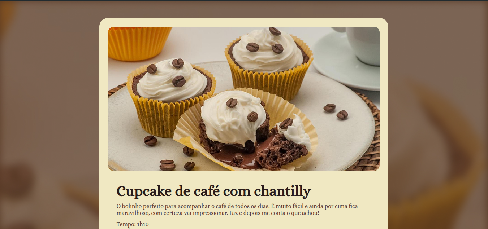

<p align="center">
  <a href="#-tecnologias">Tecnologias</a>&nbsp;&nbsp;&nbsp;|&nbsp;&nbsp;&nbsp;
  <a href="#-projeto">Projeto</a>&nbsp;&nbsp;&nbsp;|&nbsp;&nbsp;&nbsp;
  <a href="#-layout">Layout</a>&nbsp;&nbsp;&nbsp;|&nbsp;&nbsp;&nbsp;
  <a href="#memo-licença">Licença</a>
</p>

<p align="center">
  
  
</p>

<br>

<p align="center">
  
</p>

## 🚀 Tecnologias

Esse projeto foi desenvolvido com as seguintes tecnologias:

- HTML
- CSS

### Bibliotecas

- [Google Fonts](https://fonts.google.com/)


### Conceitos aplicados

- Estruturação semântica de documentos HTML
- Estilização de layout com CSS3
- Manipulação de listas e imagens
- Aplicação cores, background e tipografia

## 💻 Projeto

**Página de receita**, é uma receita de um Cupcake de café com chantilly, ideal para os amantes de sobremesas. 

Exemplo: Desenvolvido com foco em interface, o projeto prioriza um design clean e agradável, garantindo uma experiência de usuário fluida.

### Como rodar o projeto

1. **Pré-requisitos:**
   - Ter o Git instalado e configurado.
2. **Clone o repositório:**
   ```bash
   git clone https://github.com/luizfpinto94/pagina-de-receita.git
3. **Acesse a pasta do projeto:**
   ```bash
   cd pagina-de-receita
4. **Abra o editor de código (Ex: Vscode):**
   Instale o plugin Live Server e abra o projeto no navegador

## 🎨 Layout

Você pode visualizar o layout do projeto através [desse link](https://www.figma.com/community/file/1360315130061454535/pagina-de-receita).
É necessário ter conta no [Figma](https://figma.com) para acessá-lo.

## 📝 Licença

Esse projeto está sob a licença MIT. Veja o arquivo [LICENSE](LICENSE) para mais detalhes.

---

